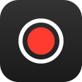

<div align="center">
  
  
  <h1>Rec</h1>
  <p><strong>Native Screen & Audio Recorder for macOS</strong></p>
  <p align="center">
  Made for  <strong>macOS</strong>
  </p>

  <p>
    
    
    
    
  </p>

  <p><em>Your recording. Simplified.</em></p>
</div>

---

**Rec** is a free, delightfully simple native screen and internal audio recorder for macOS. It features an unobtrusive floating UI, allowing you to capture exactly what you need without cluttering your workspace.

Built with Apple's modern ScreenCaptureKit framework, Rec seamlessly records your system's internal audio right alongside your video feed—without needing any third-party audio drivers. **100% on-device, no cloud, no accounts, no subscriptions.**

## 🔒 Why Rec?

| Feature | Rec | Native macOS Screen Recorder |
| :--- | :--- | :--- |
| **Internal Audio** | 🔊 **Included Native Capture** | 🔇 Requires 3rd-party drivers |
| **UI** | 🪟 **Floating Panel** | 🪟 Floating Panel |
| **Specific App** | 🎯 **Yes, Window Target** | ❌ No |
| **Custom Quality** | ⚙️ **Selectable FPS, Res, Bitrate** | ❌ Fixed |
| **Timer** | ⏱️ **None, 5s, or 10s** | ⏱️ 5s or 10s |

## ✨ Key Features

*   **Live Screen Annotations**: ✏️ Apple Markup-style floating HUD with Pen, Brush, Highlighter, Magic Laser Writer (auto-fading glowing trails), Shapes (Arrow, Rectangle, Oval), Color Swatches + Picker, and Eraser. Palette is automatically excluded from recordings while drawings are captured cleanly.
*   **Internal Audio**: 🔊 Seamlessly captures your Mac's internal audio right alongside your video feed using ScreenCaptureKit. No 3rd-party audio loopback drivers needed.
*   **In-App Video Editor**: ✂️ Trim recordings with smooth timeline scrubbing, audio muting, and 1-click in-place overwrite saving directly to the original file without duplicate clutter.
*   **Floating HUD Toast**: 🔔 Non-intrusive bottom-right notification toast with 7-second auto-dismiss, hover-to-pause, 1-click clipboard copy, and full right-click shortcuts.
*   **Multiple Modes**: 🎯 Record your entire screen, click-and-drag to select a specific region, or record a specific application window.
*   **Dynamic Controls & Pro FPS**: ⚡️ Live duration timer during recording, Clickity-style tap feedback ripples, and custom framerates from 15 FPS up to 120 FPS ProMotion.
*   **Custom Quality**: ⚙️ Adjust your Framerate, Resolution (Native Retina, 1080p, or 720p), and Video Encoding Bitrate.
*   **Camera Overlay**: 📹 Display a circular, floating camera overlay alongside your screen recording to add a personal touch.
*   **Cursor Highlighting**: 🖱️ Highlight your mouse clicks and cursor movements with customizable colors for clear tutorials and presentations.
*   **Countdown Timer**: ⏱️ Set a 5 or 10-second countdown delay before recording officially begins.
*   **Native & Fast**: 🚀 Encodes directly to a multiplexed `.mov` file using hardware acceleration via AVAssetWriter. No post-processing delays.

## ⌨️ Shortcuts

| Shortcut | Action |
| :--- | :--- |
| `⌘R` | Start / Stop Screen Recording |
| `⌥A` | Toggle Screen Annotation Palette (Anytime) |
| `1` .. `8` | Quick-Switch Tool (1: Pen, 2: Brush, 3: Highlighter, 4: Magic, 5: Arrow, 6: Rect, 7: Oval, 8: Eraser) |
| `⌘Z` / `⇧⌘Z` | Undo / Redo Annotation Stroke |
| `⌘K` | Clear All Annotations |
| `Esc` | Close Annotation Mode |

## 📦 Install

### One-Liner Terminal Install (Recommended)
```bash
/bin/bash -c "$(curl -fsSL https://raw.githubusercontent.com/arunofhyd/Rec/main/install-rec.command)"
```

### Manual Installation (Fallback)
If you prefer to download and run the installer script manually:

1. **Download** [`install-rec.command`](install-rec.command) (open the file, then click **Download raw file**).
2. Open **Terminal** (`⌘ + Space`, type `Terminal`, press Enter).
3. Type `sh ` — that's **s**, **h**, then a **space**.
4. **Drag** the downloaded `install-rec.command` into the Terminal window (its path fills in automatically).
5. Press **Enter**, follow the prompts, then **drag Rec onto the Applications folder**.

> **First time only:** The installer may ask to install Apple's Command Line Tools (a small, official Apple download). Click **Install**, wait, then continue. This lets your Mac build the app locally — which is why macOS trusts it and never shows a "damaged app" warning.

After installing, look for the **record circle icon in your menu bar** (top-right).

## ⚙️ How It Works

The installer downloads the app's source and **builds it right on your Mac**. Because it's compiled locally rather than downloaded pre-made, macOS Gatekeeper trusts it — no bypassing scary warnings.

## 🗑️ Uninstall

1. Quit Rec (menu-bar icon → **Quit**).
2. Drag **Rec** from Applications to the Trash.
3. To remove saved data: delete `~/Library/Application Support/Rec`.

## 📦 Tech Stack
*   **Swift** (AppKit)
*   **ScreenCaptureKit** (Native video/audio capturing)
*   **AVFoundation** (Hardware-accelerated multiplexing)
*   **Shell** (Installer & Builder)

## 📄 License
MIT License. Free for personal use.

---

<p align="center">
  Made with ❤️ by <a href="mailto:arunthomas04042001@gmail.com">Arun Thomas</a>
</p>
